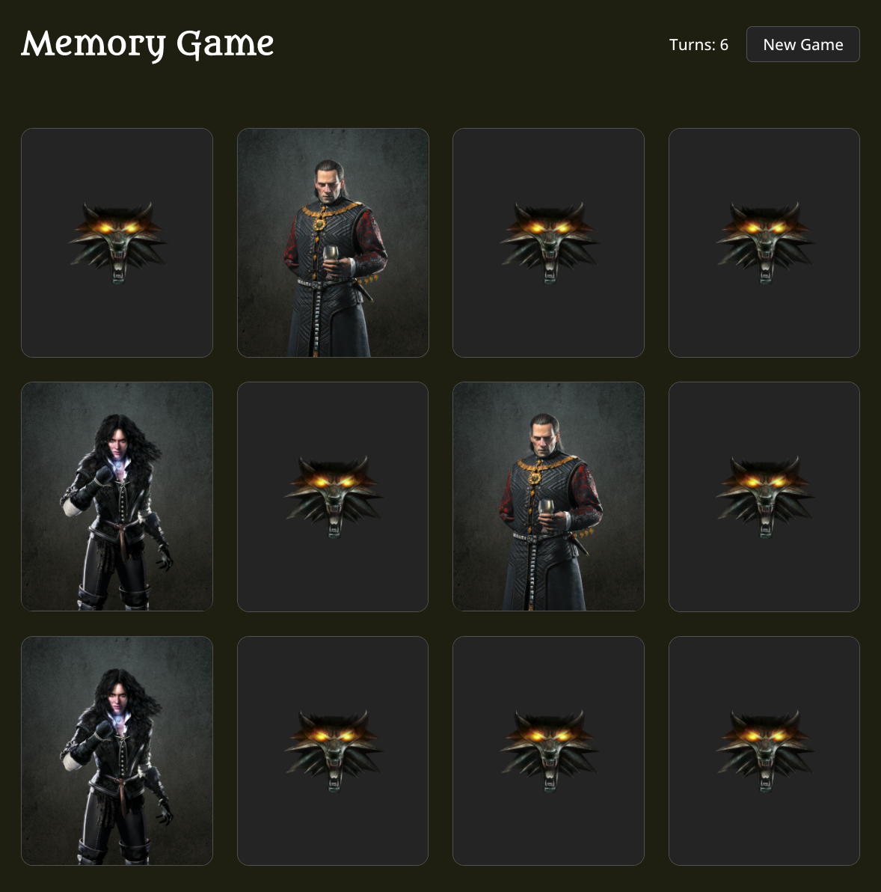

# Javascript/React - Memory Game

For this project I created a memory game

- The project is set up with [create-react-app](https://create-react-app.dev/docs/getting-started).
- I used react hooks (useState ans useEffect).
- I used styled-components.
- Code is commented so you can see what each part is doing.
- I also created the cards by splicing together background images and png's (with no background) that I found online.

### [Link to Live Site](https://hebaulf.github.io/memory-game/)

### [Link to Figma file for cards](https://www.figma.com/file/4CgYEbhL3pIVVN996kCxPy/Matching-Card-Game?node-id=0%3A1)

 

  

 

## If you want to play around with the code

You can clone the repo:\

#### `git clone https://github.com/hebaulf/memory-game.git`

 

Then install all dependencies:\

#### `npm install`

 

And at last run the app:\

#### `npm start`

Runs the app in the development mode.\
Open [http://localhost:3000](http://localhost:3000) to view it in your browser.
